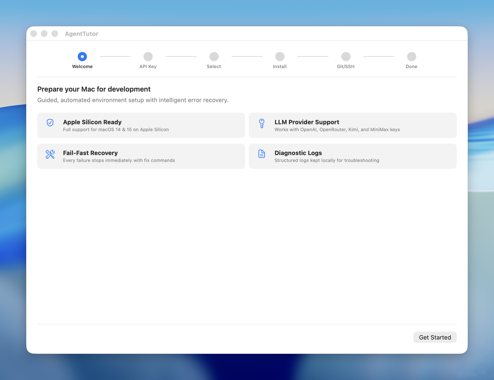

# AgentTutor

AgentTutor is a macOS desktop setup assistant for Apple Silicon developer machines.  
It runs a guided setup flow, installs a curated toolchain, verifies each component, and stops immediately on failures with remediation guidance.

## Screenshot



## Current Capabilities

- 6-stage SwiftUI setup wizard: welcome -> OpenAI config -> component selection -> install -> Git/SSH -> completion
- Manifest-driven install catalog (`InstallCatalog`) with dependency resolution (`InstallPlanner`)
- Preflight + post-install verification checks for every install item
- Fail-fast execution with remediation advice (`heuristics` first, OpenAI fallback through `gpt-4.1-mini`)
- User-approved remediation command execution with safety filtering (`CommandSafety`)
- Post-install Git identity setup (`git config --global user.name` / `user.email`) and SSH key management (`~/.ssh/id_ed25519`)
- GitHub auth policy is centralized and uses SSH git protocol end-to-end
- Session JSONL logs in `~/Library/Application Support/AgentTutor/logs/`
- API key is in-memory only and never written to disk

## Policy Decisions (2026-02-09)

- Installation start must be blocked unless API key/base URL validation succeeds.
- Environment baseline is Homebrew `node@22` + Homebrew `python@3.10`.
- `nvm` remains in Core CLI as an optional future-development tool, not a baseline environment requirement.

## Requirements

- macOS 14+
- Apple Silicon (M1+)
- Xcode 16+ (CI currently runs Xcode 16.4 image)
- OpenAI API key/base URL validation is required before install can start

## Repository Layout

```
AgentTutor/
├── Core/
│   ├── SetupModels.swift
│   ├── Install/
│   │   ├── InstallCatalog.swift
│   │   ├── InstallPlanner.swift
│   │   ├── ShellExecutor.swift
│   │   └── InstallLogger.swift
│   └── AI/
│       └── RemediationAdvisor.swift
├── Features/Setup/
│   ├── SetupFlowView.swift
│   └── SetupViewModel.swift
├── Scripts/
│   ├── build.sh
│   ├── test.sh
│   ├── package_app.sh
│   └── release.sh
└── .github/workflows/
    ├── ci.yml
    └── tag-release.yml
```

## Install Catalog

Single source of truth: `AgentTutor/Core/Install/InstallCatalog.swift`.

| Item | Required | Default Selected | Category |
|---|---|---|---|
| Xcode Command Line Tools | Yes | Yes | System |
| Homebrew | Yes | Yes | System |
| Core CLI Tools (`rg`, `fd`, `jq`, `yq`, `gh`, `uv`, `nvm`) | Yes | Yes | CLI Tools |
| Node.js 22 LTS (`node@22` via Homebrew) | No | Yes | Runtimes |
| Python 3.10 (`python@3.10` via Homebrew) | No | Yes | Runtimes |
| Visual Studio Code | No | Yes | Desktop Apps |
| Codex CLI | No | Yes | Desktop Apps |
| GitHub CLI Login | Yes | Yes | Authentication |

## Build, Test, Package

```bash
# Open project
open AgentTutor.xcodeproj

# Build
./Scripts/build.sh --configuration Debug

# Unit tests (default scope)
./Scripts/test.sh --unit

# Full scheme tests (includes UI tests)
./Scripts/test.sh --all

# Package release artifacts
./Scripts/package_app.sh --configuration Release
```

By default scripts produce output under `Build/`:

- `Build/DerivedData`
- `Build/TestResults/*.xcresult`
- `Build/Artifacts/AgentTutor-<version>-<build>/`

For unsigned CI-style builds on machines without signing identities:

```bash
AGENTTUTOR_DISABLE_CODE_SIGNING=1 ./Scripts/build.sh --configuration Debug
```

## Release and Automation

```bash
# Local release flow (build + unit test + package)
./Scripts/release.sh --configuration Release

# Local notarize + GitHub release publish
./Scripts/release.sh --configuration Release --notarize --publish --tag v1.0.0
```

Detailed release procedures and credential requirements: [`docs/RELEASING.md`](docs/RELEASING.md).

## GitHub Actions

- `CI` (`.github/workflows/ci.yml`)
  - Trigger: PR to `main`, push to `main`, manual dispatch
  - Steps: script syntax check, debug build, unit test, packaging smoke test
  - Uploads test results and packaging artifacts (when present)
- `Tag Release` (`.github/workflows/tag-release.yml`)
  - Trigger: push tag `v*`
  - Guard: tag must equal `v<MARKETING_VERSION>`
  - Steps: unit tests, release packaging, upload workflow artifacts, publish GitHub Release assets

Both workflows run with `AGENTTUTOR_DISABLE_CODE_SIGNING=1`.

## License

Private project.
